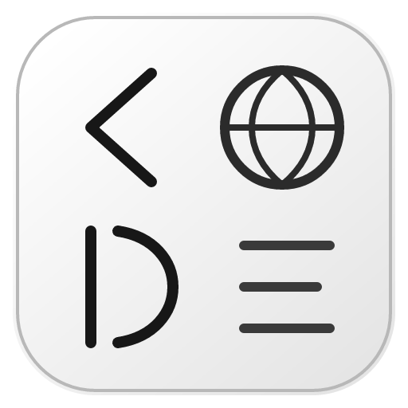

<div align="center">
  
  <h1>OpenWebCode</h1>
  <p><strong>An AI coding workbench that runs in your browser</strong></p>
  <p>
    <a href="https://github.com/snnh/openwebcode/releases"></a>
    <a href="./LICENSE"></a>
    
  </p>
  <p>English | <a href="./README.md">简体中文</a></p>
</div>

**README_en.md translated by kimi-k3**

OpenWebCode is an AI coding workbench that runs in your browser, with a bilingual Chinese/English interface, natively supporting Windows (x86-64) and Linux (x86-64 / arm64 / loongarch64). Install it locally, open your browser, and let the agent read code, edit files, and run commands for you.

```text
Browser (React 19 + Vite 6) ── HTTP/WebSocket ──► Node service (agent loop, tools, permissions) ── JSON-RPC/stdio ──► C executor (commands, files, sandbox, snapshots)
```

## System requirements

1. Server:
   - OS: Windows 10+ (Windows 7 untested) or Linux
     - Linux: glibc ≥ 2.28; kernel ≥ 5.13 (Landlock baseline; ≥ 6.7 adds network denial). The default sandbox backend is bubblewrap (full namespace isolation): where bubblewrap is unavailable, the default backend fails with a clear error — install bubblewrap (e.g. `apt install bubblewrap`) or switch the session sandbox mode to the Landlock compatibility mode explicitly (weaker). Developed and verified on Debian 13 / Ubuntu 24.04.
     - A HarmonyOS port is in development.
   - Architectures: x86-64 / arm64 / loongarch64 (the Loongson package ships no bundled Node.js and needs system Node.js ≥ 24)
   - CPU: dual-core 2.0 GHz
   - Memory: ≥ 512 MiB free (1 GiB free recommended)
   - Disk: ≥ 500 MiB free

2. Client:
   Any device that can run Chrome / Edge ≥ 111 or Firefox ≥ 113 (including phones and tablets).

## Features

- **AI coding**: read/write code, edit files, run commands and tests, symbol index and diagnostics — all inside the agent.
- **Chat mode**: a lightweight ChatGPT-style conversation (in development, off by default), sharing the same session/model/permission state as the workbench.
- **Resource usage friendly to low-spec devices**: see [Performance and footprint](#performance-and-footprint).
- **Comparatively complete sandbox**: Job Object / AppContainer / WSB on Windows, bubblewrap / Landlock on Linux.
- **Git and filesystem-level snapshots**: ZFS / Btrfs / overlayfs / VHDX / qcow2 backends, auto-detected with silent fallback on failure.
- **Context management**: a tunable auto-compaction threshold and compaction output budget; manual `/compact` validates output against verbatim echoing and degrades gracefully on fast-model failure; rolling eviction, context-entry management, and selective context (pin/exclude) are provided by the official context-saver extension and can be switched off wholesale.
- **Multi-model support**: Anthropic Messages / OpenAI Chat Completions / OpenAI Responses interfaces; **switch model and thinking tier mid-run** (no interruption to in-flight requests, effective on the next turn).
- **Environment simulation (env-sim)**: switch the system prompt and tool surface to the style of well-known AI coding products (Claude Code / Kimi / ZCode / Codex / DSH presets) while keeping the original tool implementations and permission chain underneath. Specifically tuned for DeepSeek V4 Pro 0813 — with that model we recommend enabling DSH minimal simulation (`dsh-minimal`).
- **Sub-agents and agent swarms**: isolated-context parallel dispatch with live progress and transcripts; both plain sub-agents and swarms that can communicate with each other.
- **A good range of extension points**: skills, slash commands, hooks, custom sub-agents, MCP, and third-party Extension Host packages.
- **Free-form session management**: edit any message, fork anytime; manual grouping, archiving, and multi-select batch operations (delete/archive/pin); export a session as a self-contained read-only HTML share page / Markdown / JSONL.
- **Local sessions**: create one with a single click from the sidebar "Terminal" icon to manage local files and services directly on the host as the server user (access outside HOME requires manual approval).
- **Built-in panels**: symbol index (`repo_map` / `code_search`), test diagnostics (Problems panel), and an SCM panel (diffs, staging, worktree merges, generated commit messages).
- **Task list**: a collapsible chip on the right side of the main tab bar shows the agent's current tasks and progress; persisted across restarts (`/clear` clears it too).
- **Web search and fetch**: Web Search / Web Fetch over configurable search providers (Jina / Brave / Tavily / Bing / SearXNG / Exa / LinkUp / Bocha / Firecrawl / Custom — 10 in total), or search executed server-side by the model provider (OpenAI Responses only).
- **Scheduled tasks (cron)**: create scheduled tasks in a session that auto-inject a prompt to continue running; 5-field cron syntax, persisted across restarts.
- **Mobile and remote access**: responsive adaptation for phones/tablets; off-loopback listening enforces an access token (auto-generated or `OWC_ACCESS_TOKEN`), with optional TOTP global login.
- **The `owc run` CLI**: headless NDJSON event stream for CI integration.
- **dsh compatibility mode (experimental, off by default)**: hosts the official dsh SPA on its own port and loads dsh-ecosystem plugins (Host tools/hooks and client UI plugins).

See the [user guide](./help/usage.md) and [FAQ](./help/faq.md) (both in Chinese) for details.

## Quick start

### Windows

1. Download `openwebcode-<version>-windows-x64.msi` from [Releases](https://github.com/snnh/openwebcode/releases) and install it (administrator rights required).
2. Open a new terminal and run `owc`, or use `bin\owc.cmd` from the install directory.
3. Open <http://127.0.0.1:3210>.

### Linux

1. x86_64, aarch64 (arm64), and Loongson loongarch64 are supported; the online installer picks the right package automatically:

```sh
curl -fsSL https://raw.githubusercontent.com/snnh/openwebcode/main/packaging/install-online.sh | bash
```

2. Or download the tar.gz for your architecture, extract it, and run `./install.sh` (an interactive terminal asks for the install prefix, port, and data directory; add `--yes` in scripts or CI to skip the questions).

Note: the loongarch64 package ships no bundled Node.js and requires system Node.js ≥ 24. See [`packaging/README.en.md`](./packaging/README.en.md) for every installer option and the systemd unit.

### Docker (Linux / macOS, x86_64 / arm64)

Release images are hosted on GitHub Container Registry (`ghcr.io/snnh/openwebcode`) with the full runtime baked in (core, Node 24, bubblewrap, git, python3); user data lives in a named volume:

```sh
# 1. Start from the repository root (pulls the GHCR release image)
docker compose up -d

# 2. Find the access link — the server auto-generates an access token on first
#    start because it listens off-loopback; the link includes the token
docker compose logs | grep 访问链接
```

Open the link from the logs (`http://<host-ip>:3210/?token=<token>`). Without compose, the equivalent is:

```sh
docker run -d --name openwebcode --restart unless-stopped \
  -p 3210:3210 -v openwebcode-data:/data \
  ghcr.io/snnh/openwebcode:latest
docker logs openwebcode | grep 访问链接
```

- **Data**: kept in the named volume `openwebcode-data`.
- **Upgrade**: `docker compose pull && docker compose up -d` — data volume is untouched.
- **Workspace**: optionally bind-mount a host directory.
- **Sandbox**: bubblewrap by default (uncomment `security_opt: seccomp=unconfined` in compose; the host must also allow unprivileged user namespaces); when bwrap is unavailable, the default backend fails with a clear error and no longer silently degrades — install bubblewrap or switch the session sandbox mode to Landlock explicitly (host kernel ≥ 5.13; weaker).
- **Build from source**: `docker build -t openwebcode .`, or uncomment `build:` in the compose file. Image layout, build, and publishing details are in the "Docker image" section of [`packaging/README.en.md`](./packaging/README.en.md).

### First run

1. Under **Settings → Model Catalog**, add and enable a model provider (Anthropic Messages, OpenAI Chat Completions, and OpenAI Responses interfaces are all supported), then refresh the catalog.
2. Click **+** in the sidebar to create a session: pick a working directory, provider/model, and sandbox mode.
3. Describe the task in the composer and press Enter.

## Composer shortcuts

| Input | Action |
| --- | --- |
| Plain text | Send instructions to the agent |
| `/skill-name` | Invoke a skill |
| `/custom-command` | Expand a template from `.owc/commands/` |
| `/compact` | Compact context (`tools` for rule-based compaction) |
| `/clear` | Clear the current view; **history is kept** and reversible |
| `/init` | Analyze the workspace and generate/update the root `AGENTS.md` (writes go through the permission chain) |
| `/help` | Open Settings → Shortcuts tab |
| `@path` | Reference a workspace file and inject its content with the message |
| `!command` | Shell shortcut through the normal permission chain |

Note: messages sent while the agent is running enter the steering queue; an image-only or attachment-only message (no text) can also be sent directly.

## Headless CLI

```sh
owc run "Add a unit test for main.ts" --cwd . --json --yolo
```

- `--json` emits one NDJSON event per line for scripts; `--yolo` auto-approves permission requests (for CI).
- `--session <id>` continues an existing session; `--tools` / `--exclude-tools` / `--read-only` restrict the tool surface; `--fallback-models` configures the fallback chain.
- Exit codes: `0` done, `1` agent error, `2` permission denied.

## Performance and footprint

Measured on a dev machine (Windows x86-64, v1.7.6, 5000-message benchmark dataset; harness and acceptance gates live in [`scripts/bench/`](./scripts/bench/)):

| Component | Memory | CPU (single-core equivalent, 95th percentile of time) | Key numbers |
| --- | --- | --- | --- |
| server (Node service) | ~74 MiB idle; ~115 MiB steady-state with a 5000-message session loaded | under 0.5% | Large-session cold load 24ms, history paging p50 0.6ms; incremental context build p50 0.35ms (31× faster than full builds); agent-loop heap churn 0.9 MiB per turn; event dispatch 5800+ events/s; symbol-index queries over 100k files p50 ~15ms symbols / ~21ms files |
| core (C executor) | ~9 MiB idle; ~15 MiB peak under a 100k-file heavy scan, released afterwards | under 0.5% | Full-repo index scan (100k files) completes in ~33s with bounded memory |
| browser | ~93 MiB heap with a 5000-message session fully loaded | - | Long-list scrolling p50 59.9 fps; input echo p50 26.5ms; 0.1% memory growth across repeated scroll cycles (no leak); chat/workbench/share views are lazy-loaded bundles, first-load script 479 KB |

Production reference (v1.7.6, Debian 13 x86-64, measured on an always-on instance): server 110 MiB + extension host 52 MiB + core 1.9 MiB (server down ~19% from 135 MiB on v1.5.0), CPU below 0.5% 95% of the time.

> As of v1.12.1, large-session memory is further optimized: each agent turn previously parsed the full `messages.jsonl` twice (~hundreds of MB heap for a single 60 MB session); now only the active segment after the `/clear` or compaction anchor is loaded — measured at full-table +101 MB / 255 ms → segment +27 MB / 133 ms for the same session. Full GC is triggered at three points (startup completion / end of each turn / idle sweep), returning V8 free pages promptly.

## Documentation

- [`help/usage.md`](./help/usage.md) — user guide: startup, panels, shortcuts, models and costs, extension-point templates (Chinese)
- [`help/faq.md`](./help/faq.md) — FAQ: model setup, permissions and sandbox, snapshot rollback, CLI integration, troubleshooting (Chinese)
- [`help/dsh-compat.md`](./help/dsh-compat.md) — dsh compatibility mode: enabling it, installing dsh plugins, supported/unsupported wire surface, trust boundary, troubleshooting (Chinese)
- [`help/development.md`](./help/development.md) — development guide: repository layout, the three builds, test conventions, entry points, CI and release (Chinese)
- [`packaging/README.en.md`](./packaging/README.en.md) — packaging, distribution layout, installers, and the release pipeline
- [`CHANGELOG.md`](./CHANGELOG.md) — version history (Chinese)

## Build from source

Requirements: Node.js ≥ 20, CMake ≥ 3.19, a C11 compiler, and Python 3 (for the core protocol tests). Each layer builds independently — there is no root `package.json`:

```sh
cmake -S core -B build && cmake --build build && ctest --test-dir build   # core (C executor)
cd server && npm ci && npm run build && npm test                          # server (Node service)
cd web && npm ci && npm run build && npm test                             # web (served statically by server)
```

## Data and configuration

Settings live in `<data directory>/server-settings.json`. The data directory resolves in this order: an explicitly set `OWC_DATA_DIR` wins; otherwise the launcher injects the platform default (`%USERPROFILE%\openwebcode` on Windows, `~/.local/share/openwebcode` on Linux); only bypassing the launcher with a direct `node server/dist/index.js` falls back to `.openwebcode` next to `server`. Keys, session data, and global extension points all live in the data directory (0600/0700 permissions on POSIX). Project-level overrides go in `.owc/` at the project root.

## Uninstall

- **Windows**: uninstall from Settings → Apps.
- **Linux**: run the uninstaller written by the installer, `~/.local/bin/owc-uninstall` (it also cleans up the systemd unit); or manually `rm -rf ~/.local/lib/openwebcode ~/.local/bin/owc ~/.local/bin/owc-uninstall`.

Note: the data directory is kept by default.

## Sponsor

OpenWebCode is an open-source project maintained by one person. If it helps your work, consider sponsoring via [donate.md](./donate.md) to support ongoing development.

## Acknowledgments

1. Thanks to deepseek, kimi-k3, and qwen for assisting development.
2. Thanks to community friends for inspiration.
3. Thanks to [pi-agent](https://github.com/earendil-works/pi); the default system prompt is adapted from its baseline (MIT, by Mario Zechner).
4. Thanks to [Shyliuli](https://github.com/Shyliuli) for helping test the Loongson (loongarch64) build.

## License

[Apache-2.0](./LICENSE)
