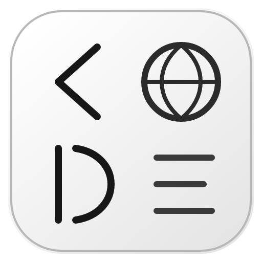

<div align="center">
  
  <h1>OpenWebCode</h1>
  <p><strong>浏览器打开即用的 AI 编码工作台</strong></p>
  <p>
    <a href="https://github.com/snnh/openwebcode/releases"></a>
    <a href="./LICENSE"></a>
    
  </p>
  <p>简体中文 | <a href="./README.en.md">English</a></p>
</div>

OpenWebCode 是一个跑在浏览器里的 AI 编码工作台，界面中英双语，原生支持 Windows (x86-64) 和 Linux (x86-64 / arm64 / loongarch64)。本地装好后用浏览器打开，就能让 agent 帮你读代码、改文件、跑命令和测试。

```
浏览器 (React)  ──HTTP/WebSocket──►  Node 服务层 (Agent 循环、工具调度)  ──JSON-RPC──►  C 执行器 (命令/文件/沙盒/快照)
```

## 主要功能

- 基础的 AI coding 功能。
- 相对完善的沙盒支持：Windows Job Object/AppContainer/WSB，Linux bubblewrap/Landlock。
- git 和文件系统级快照：ZFS / Btrfs / overlayfs / VHDX / qcow2 多种后端。
- 更好的上下文管理。
- 多模型适配：多服务商并存、会话中热切换，四档角色按任务路由，主模型报错沿备选链自动切换。
- 子代理和 agent swarm：隔离上下文并行派发，进度和转录实时可见。
- 较多的扩展支持：Skills、斜杠命令、Hooks、自定义子代理、MCP 和 Extension Host 第三方扩展。
- 自由的会话管理：消息随意改、分叉随时开。
- 内置符号索引（`repo_map` / `code_search`）、测试诊断（Problems 面板）、SCM 面板（diff、stage、worktree 合回、生成提交信息）。
- `owc run` cli 支持。

具体详见 [使用帮助](./help/usage.md) 和 [常见问题](./help/faq.md)。

## 快速开始

### Windows

1. 从 [Releases](https://github.com/snnh/openwebcode/releases) 下载 `openwebcode-<version>-windows-x64.msi` 双击安装（需要管理员权限）。
2. 重新打开终端运行 `owc`，或者直接用安装目录里的 `bin\owc.cmd`。
3. 浏览器打开 <http://127.0.0.1:3210>。

### Linux

1. 支持 x86_64、aarch64（arm64）和龙芯 loongarch64，在线安装脚本会按架构自动选包：

```sh
curl -fsSL https://raw.githubusercontent.com/snnh/openwebcode/main/packaging/install-online.sh | bash
```

2. 手动下载对应架构的 tar.gz，解压后运行 `./install.sh`（交互式终端里会问你安装前缀、端口和数据目录；脚本或 CI 里加 `--yes` 跳过提问）。

注：龙芯包不内置 Node.js，需要系统里有 Node.js ≥ 24。完整的安装选项和 systemd 服务说明见 [`packaging/README.md`](./packaging/README.md)。

### 首次使用

1. 在 **设置 → 模型目录** 添加并启用一个模型服务商（Anthropic Messages / OpenAI Chat Completions / OpenAI Responses 三种接口都支持），然后刷新模型目录。
2. 点侧栏的 **+** 新建会话，选工作目录、服务商/模型和沙盒模式。
3. 在输入框里描述任务，回车发送。

## 输入框速查

| 输入 | 含义 |
|---|---|
| 普通文本 | 发给 agent 的任务描述 |
| `/技能名` | 触发 Skill |
| `/自定义命令` | 触发 `.owc/commands/` 里的斜杠命令模板 |
| `/compact` | 压缩上下文（加 `tools` 参数走规则压缩） |
| `/clear` | 清空当前视图，**历史保留**，可以回滚 |
| `@路径` | 引用工作区文件，内容随消息一起注入 |
| `!命令` | shell 快捷前缀，走 bash 权限链执行 |

注：agent 运行时发的消息会进入 steering 队列。

## Headless CLI

```sh
owc run "给 main.ts 加个单元测试" --cwd . --json --yolo
```

- `--json` 输出 NDJSON 事件流，方便脚本解析；`--yolo` 自动批准权限请求（CI 场景）。
- `--session <id>` 接着已有会话继续；`--tools` / `--exclude-tools` / `--read-only` 可以限制工具范围。
- 退出码：`0` 完成，`1` agent 出错，`2` 权限被拒绝。

## 文档

- [`help/usage.md`](./help/usage.md) — 使用帮助：启动、面板、快捷键、模型与成本、自定义扩展点模板
- [`help/faq.md`](./help/faq.md) — 常见问题：模型接入、权限与沙盒、快照回滚、CLI 集成、故障排查
- [`help/development.md`](./help/development.md) — 二次开发：仓库布局、三件套构建、测试约定、切入点、CI 与发布
- [`packaging/README.md`](./packaging/README.md) — 打包流程、分发布局、安装脚本与发布流水线
- [`CHANGELOG.md`](./CHANGELOG.md) — 版本更新日志

## 从源码构建

需要 Node.js ≥ 20、CMake ≥ 3.19、C11 编译器和 Python 3（core 协议测试用）。三层各自独立构建，仓库根目录没有 `package.json`：

```sh
cmake -S core -B build && cmake --build build && ctest --test-dir build   # core（C 执行器）
cd server && npm ci && npm run build && npm test                          # server（Node 服务层）
cd web && npm ci && npm run build && npm test                             # web（产物由 server 静态托管）
```

## 数据与配置

设置保存在 `<数据目录>/server-settings.json`。数据目录按这个顺序确定：先看有没有显式设置 `OWC_DATA_DIR`；没有就用启动器注入的平台默认值（Windows 是 `%USERPROFILE%\openwebcode`，Linux 是 `~/.local/share/openwebcode`）；只有绕过启动器直接跑 `node server/dist/index.js` 时，才会落到 `server` 旁边的 `.openwebcode`。密钥、会话数据和全局扩展点都在数据目录里，POSIX 下权限一律 0600/0700。项目级的覆盖配置放在项目根目录的 `.owc/` 下。

## 卸载

- **Windows**：「设置 → 应用」里卸载。
- **Linux**：`rm -rf ~/.local/lib/openwebcode ~/.local/bin/owc`。
注：数据目录默认保留

## 赞助

OpenWebCode 是个人维护的开源项目。如果它对你有帮助，欢迎通过 [donate.md](./donate.md) 赞助支持持续开发。


## 特别感谢

1. 感谢 deepseek、kimi-k3、qwen，本项目由上述模型辅助开发
2. 感谢一些群友提供的灵感
3. 感谢 [pi-agent](https://github.com/earendil-works/pi)，本项目默认系统提示词以其为基线（MIT，作者 Mario Zechner）

## License

[Apache-2.0](./LICENSE)
